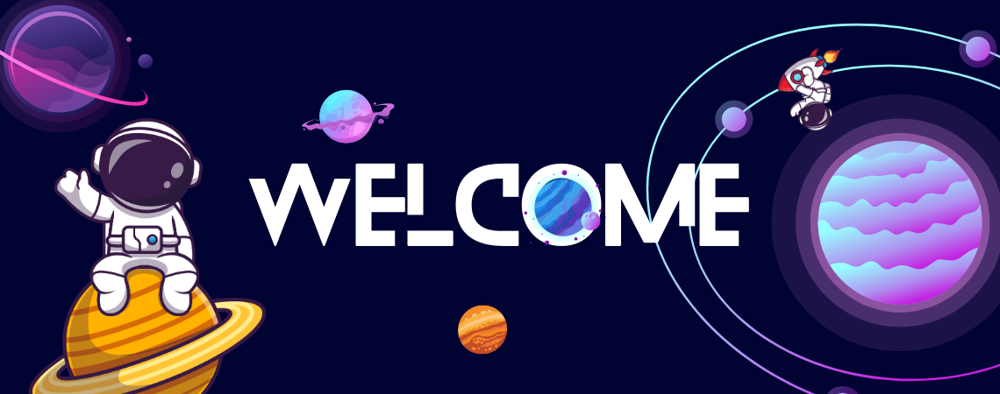

 
## Hello my name is David Enrique Morales Cajina 👋

-🔭 I am currently working as a web developer. 

-🤓 I specialize in technologies such as HTML, CSS, JS, React, PHP, among others..  

-🤝🏻 I enjoy working, collaborating with other developers and improving my skills. 

-💪🏽 I like to take challenges and improve every day  

-😋 I love soda and sweet desserts. 

-🎬🍿I love watching movies, superhero series and anime.

-🌍 I'm based in Nicaragua

-🖥️ You can view my portfolio on my <a href="https://david-morales.netlify.app/" target="_blank">website</a>.

-✉️ You can contact me at davidenriquemorales4@gmail.com

##  Languages and Tools

  
  
  
  
  
  
    
  
   
  

### Thank you for viewing my profile 
